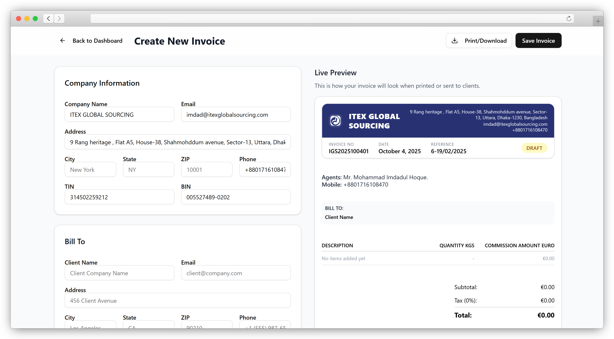

## Overview

This project uses the following tech stack:
- Vite
- Typescript
- React Router v7 (all imports from `react-router` instead of `react-router-dom`)
- React 19 (for frontend components)
- Tailwind v4 (for styling)
- Shadcn UI (for UI components library)
- Lucide Icons (for icons)
- Convex (for backend & database)
- Convex Auth (for authentication)
- Framer Motion (for animations)
- Three js (for 3d models)

All relevant files live in the 'src' directory.

Use pnpm for the package manager.

## Setup

This project is set up already and running on a cloud environment, as well as a convex development in the sandbox.

## Environment Variables

The project is set up with project specific CONVEX_DEPLOYMENT and VITE_CONVEX_URL environment variables on the client side.

The convex server has a separate set of environment variables that are accessible by the convex backend.

Currently, these variables include auth-specific keys: JWKS, JWT_PRIVATE_KEY, and SITE_URL.


# Using Authentication (Important!)

You must follow these conventions when using authentication.

## Auth is already set up.

All convex authentication functions are already set up. The auth currently uses email OTP and anonymous users, but can support more.

The email OTP configuration is defined in `src/convex/auth/emailOtp.ts`. DO NOT MODIFY THIS FILE.

Also, DO NOT MODIFY THESE AUTH FILES: `src/convex/auth.config.ts` and `src/convex/auth.ts`.

## Using Convex Auth on the backend

On the `src/convex/users.ts` file, you can use the `getCurrentUser` function to get the current user's data.

## Using Convex Auth on the frontend

The `/auth` page is already set up to use auth. Navigate to `/auth` for all log in / sign up sequences.

You MUST use this hook to get user data. Never do this yourself without the hook:
```typescript
import { useAuth } from "@/hooks/use-auth";

const { isLoading, isAuthenticated, user, signIn, signOut } = useAuth();
```

## Protected Routes

When protecting a page, use the auth hooks to check for authentication and redirect to /auth.

## Auth Page

The auth page is defined in `src/pages/Auth.tsx`. Redirect authenticated pages and sign in / sign up to /auth.

## Authorization
#+ ITEX Invoice Generator



Live demo: https://itexinvoicegenerator.vercel.app/

## What this is

ITEX Invoice Generator is a web app for creating, previewing, and managing invoices and proforma invoices. It pairs a modern, responsive frontend with Convex as the backend and auth provider.

Key features
- Create and edit invoices and proforma invoices
- Live, side-by-side preview while editing
- Email OTP authentication (Convex Auth) and anonymous sessions
- Responsive UI built with Shadcn primitives and Tailwind CSS
- Fast dev experience with Vite and simple Vercel deployment

## Tech stack

- Vite
- TypeScript
- React 19
- Tailwind CSS v4
- Shadcn UI
- Framer Motion
- Three.js (optional visuals)
- Convex (database, server, auth)

## Quick start (developer)

Run these commands in PowerShell (Windows):

```powershell
pnpm install
pnpm dev
```

Open http://localhost:5173 after the dev server starts.

## Environment variables

Local client variables live in `.env.local` at the repo root. Example (already present in this repo):

```bash
CONVEX_DEPLOYMENT=dev:majestic-wildebeest-315 # team: md-asif-islam, project: itex-invoice
VITE_CONVEX_URL=https://majestic-wildebeest-315.convex.cloud
```

Server-side Convex secrets (JWT_PRIVATE_KEY, JWKS, SITE_URL, etc.) should be set in the Convex dashboard or your deployment environment and must not be committed to source control.

## Authentication

Auth is pre-wired using Convex Auth (email OTP + anonymous). Use the provided `useAuth` hook on the frontend:

```ts
import { useAuth } from "@/hooks/use-auth";

const { isLoading, isAuthenticated, user, signIn, signOut } = useAuth();
```

Auth-related files you shouldn't modify unless you know what's required:

- `src/convex/auth/emailOtp.ts`
- `src/convex/auth.config.ts`
- `src/convex/auth.ts`

## Contributing

1. Create a branch from `main`
2. Add a focused change (bugfix, test, or small feature)
3. Open a PR with a clear description and screenshots if UI changed

## Deployment

The project is ready for Vercel. The live site is here:

https://itexinvoicegenerator.vercel.app/

To deploy manually, connect your Git repo to Vercel and configure environment variables in the Vercel dashboard.

## Project layout

- `src/` — application code
- `src/pages` — route pages
- `src/components` — UI components (including `ui/` shadcn primitives)
- `src/convex` — Convex backend functions, schema, and auth

## Credits & License

Built with Vite, React, Tailwind, Shadcn UI and Convex.

MIT
